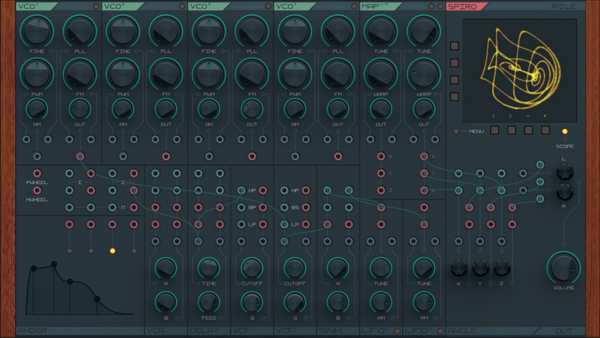

### Spiro
**Semi-modular VST / Standalone Synthesizer**
Pre-Alpha Release

<a href="./Source/assets/screen_a.jpg"></a>


|Module|Feature|Options| 
|-|-|-|
|**VCO (4X)**   | Modes         | Poly, Mono, Freerun | 
|               | Modulation    | Amplitude (AM), Frequency (FM), Pulse Width (PWM), Phase Locked Loop (PLL), Detune |
|               | Waveforms     | Tomisawa (Adjustable pulse-width sine), Pulse, Hexagon (Saw - Triangle - Ramp) |
|**CSO (2X)**   | Modulation    | Frequency, Warp |
|               | Waveforms     | Sprott, Helmholz, Halvorsen, TSUCS |
|**ADSR (4X)**  | Modes         | Freerun, Triggered |
|**VCA (2X)**   | Modulation    | Amplitude |
|**LFO (2X)**   | Modulation    | Amplitude, Frequency |
|               | Waveforms     | Sine, Square, Ramp, Saw, Triangle |
|**SNH (2X)**	| Modulation  	| Time |
|  **Delay**	| Modulation 	| Time, Feedback |
|**VCF (2X)**	| Modulation 	| Frequency, Resonance |
|				| Outputs		| Low Pass, High Pass, Band Pass |
|**Rotor** 		| Modulation 	| Angle X, Angle Y, Angle Z |
|**Mixer**		| Modulation 	| LC->L Crossfade, RC->Right Crossfade |


##  Build Instructions

### **Prerequisites**

Before building, ensure you have:

-   **C++20 or later**

-   **A compatible compiler:**
    
    -   Windows: **MSVC / Clang**
    -   Linux: **GCC / Clang**
    -   macOS: **Xcode / Clang**
        

### **Steps to Build**
**Linux**
1.  **Clone the Repository**
    ```
    git clone https://github.com/p-o-l-e/spiro.git
    cd spiro/Builds/LinuxMakefile
    ```
3.  **Compile** 
    ```
    make CONFIG=Release
    
    ```
4.  **Run (Standalone Mode)**
    ```
    ./build/spiro
    
    ```

### **⚠️ Pre-Alpha Caveats:**

Spiro is still in its early pre-alpha phase, meaning some features may be incomplete, unstable, or subject to change as development progresses.

**Known Limitations:**

Potential bugs & crashes – The codebase is evolving, so unexpected behavior may occur.

UI/UX refinements ongoing – Some interface elements may not be fully optimized.

Performance tuning in progress – Audio processing efficiency may vary depending on the system.

Cross-platform compatibility not guaranteed – Currently tested only on Linux, with macOS and Windows testing needed.

Feature changes may happen – Some modules, parameters, or workflows might be adjusted before the first stable release.

**How You Can Help:**

Report issues & feedback to help refine performance and stability.

Test on macOS & Windows to assist with cross-platform improvements.

Share thoughts on usability & workflow to shape future updates.

Your input will directly influence Spiro's evolution—let’s build something great together!

